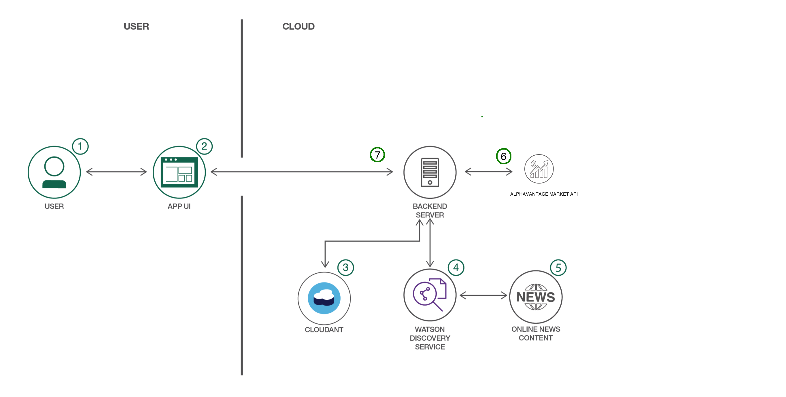

[](https://travis-ci.org/IBM/watson-stock-advisor)

# Watson Stock Advisor



## Flow
1. The user interacts with the backend server via the app UI. Here they are able to add and remove stocks they are interested in.
2. User input is processed and routed to the backend server, which in turn uses Watson Discovery and a Cloudant NoSQL database. 
3. The backend server stores stock information in a Cloudant NoSQL database for easy retrieval.
4. The backend server uses the Watson Discovery to find information about a specific company.
5. The Watson Discovery Service queries the Watson News Collection for articles related to the company.
6. The AlphaVantage APIs are queried to find market price for a given company.
7. News, sentiment, and stock price are all returned and rendered in the web app to the user.

## Included Components

* [Watson Discovery](https://www.ibm.com/watson/developercloud/discovery.html): A cognitive search and content analytics engine for applications to identify patterns, trends, and actionable insights.
* [Cloudant NoSQL DB](https://console.ng.bluemix.net/catalog/services/cloudant-nosql-db): A fully managed data layer designed for modern web and mobile applications that leverages a flexible JSON schema.

## Featured Technologies

* [NodeJS](https://nodejs.org/en/): Node.js® is a JavaScript runtime built on Chrome's V8 JavaScript engine. Node.js uses an event-driven, non-blocking I/O model that makes it lightweight and efficient. Node.js' package ecosystem, npm, is the largest ecosystem of open source libraries in the world.

## Deploy to IBM Cloud

[](https://bluemix.net/deploy?repository=https://github.com/IBM/watson-stock-advisor)

TODO: Update steps, if user uses this deploy button.


## Run locally

1. [Clone the repo](#1-clone-the-repo)
2. [Create IBM Cloud services](#2-create-ibm-cloud-services)
3. [Configure Watson Discovery](#3-configure-watson-discovery)
4. [Provision NoSQL DB](#4-provision-nosql-db)
5. [Web Portal](#5-web-portal)
6. [Get IBM Cloud credentials and add to .env](#3-get-ibm-cloud-services-credentials-and-add-to-env-file)
7. [Run the application](#7-run-the-application)

### 1. Clone the repo

Clone the `watson-stock-advisor` locally. In a terminal, run:

```
$ git clone https://github.com/ibm/watson-stock-advisor
```


### 2. Create IBM Cloud services

Create the following services:

  * [**Watson Discovery**](https://console.ng.bluemix.net/catalog/services/discovery)
  * [**Cloudant NoSQL DB**](https://console.ng.bluemix.net/catalog/services/cloudant-nosql-db/)


### 3. Configure Watson Discovery

Launch the **Watson Discovery** tool. The first time you do this, you will see
"Before working with private data, we will need to set up your storage". Click 'Continue' and
wait for the storage to be set up.

Choose `Watson Discover News`

Under the `Overview` tab, `Collection Info` section, click `Use this collection in API` and copy the `Collection ID` and the `Environment ID` into your .env file as `DISCOVERY_COLLECTION_ID` and `DISCOVERY_ENVIRONMENT_ID`.


### 4. Provision NoSQL DB

1. Navigate to console.bluemix.net
2. Click 'Create Resource'
3. Search for 'cloudant nosql'
4. Select the only search result under 'Data & Analytics' called 'Cloudant NoSQL DB'
5. Specify the settings you want
6. Click 'Create' in the bottom right


### 5. Web Portal

The web page is adapted from a [template](https://startbootstrap.com/template-overviews/sb-admin/ "Start Boostrap SB Admin") from [Start Bootstrap](https://startbootstrap.com/ "Start Bootstrap") by [Blackrock Digital](https://github.com/BlackrockDigital "Blackrock Digital").
You can find the repository for the template [here](https://github.com/BlackrockDigital/startbootstrap-sb-admin "SB Admin Repo"), including its [License](https://github.com/BlackrockDigital/startbootstrap-sb-admin/blob/master/LICENSE "SB Admin License").


### 6. Get IBM Cloud Services Credentials and add to .env file

As you create the Blumix Services, you'll need to create service credentials and get the
username and password:

Move the watson-stock-advisor/web/env.sample file to watson-stock-advisor/web/.env and populate the service
credentials (and Cloudant URL) as you create the credentials:

The credentials for IBM Cloud services (Discovery), can be found in the ``Services`` menu in IBM Cloud,
by selecting the ``Service Credentials`` option for each service.

The other settings for Discovery were collected during the
earlier setup steps (``ENV_ID``).

Navigate to the web directory and Copy the [`env.sample`](env.sample) to `.env`.

```
$ cp env.sample .env
```

Edit the `.env` file with the necessary settings.

#### `env.sample:`

```
# Replace the credentials here with your own.
# Rename this file to .env before starting the app.

# Watson Discovery
DISCOVERY_USERNAME="XXXXXXXX"
DISCOVERY_PASSWORD="XXXXXXXXX"
DISCOVERY_VERSION="v1"
DISCOVERY_VERSION_DATE="2017-11-07"
DISCOVERY_ENV_ID="system"

# Cloudant
CLOUDANT_KEY="XXXXXXXXX"
CLOUDANT_PASSWORD="XXXXXXXXXXXXXXX"
CLOUDANT_ACCESS="XXXXXXXXXXXXXX-bluemix.cloudant.com"
DB_NAME="XXXXXXXXXX"

# App Config
MAX_COMPANIES=20
MAX_ARTICLES_PER_COMPANY=100

# AlphaVantage
ALPHAVANTAGE_API_KEY="demo"
```

### 7. Run the application

#### If you decided to run the app locally...

In the root directory, run:

```
$ npm install
$ npm start
```
The portal should now be accessible on port 8080 (or another port specified by PORT in .env)

## Links

* [Watson Discovery](https://www.ibm.com/watson/services/discovery/)
* [IBM Cloudant db](https://www.ibm.com/cloud/cloudant)

## Learn more

* **Artificial Intelligence Code Patterns**: Enjoyed this Code Pattern? Check out our other [AI Code Patterns](https://developer.ibm.com/code/technologies/artificial-intelligence/).
* **AI and Data Code Pattern Playlist**: Bookmark our [playlist](https://www.youtube.com/playlist?list=PLzUbsvIyrNfknNewObx5N7uGZ5FKH0Fde) with all of our Code Pattern videos
* **With Watson**: Want to take your Watson app to the next level? Looking to utilize Watson Brand assets? [Join the With Watson program](https://www.ibm.com/watson/with-watson/) to leverage exclusive brand, marketing, and tech resources to amplify and accelerate your Watson embedded commercial solution.

## License

[Apache 2.0](LICENSE)


